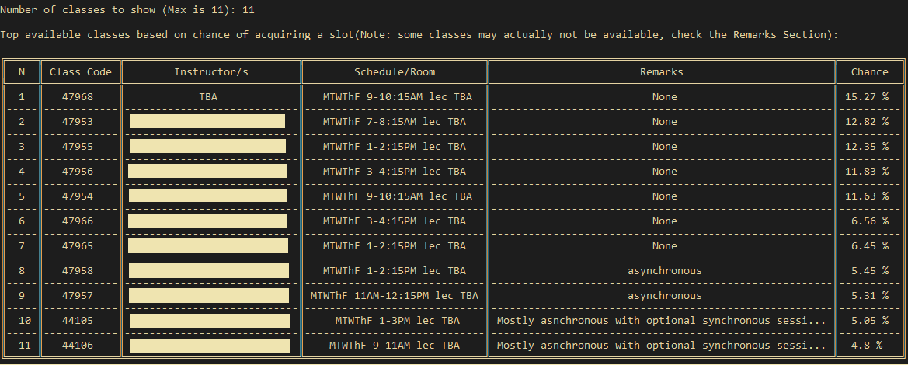

# CRS Seeker

## Note
This program uses `BeautifulSoup` for parsing CRS' HTML, run `pip install bs4` if you don't have it yet.

## How to Build
```
git clone https://github.com/marshblocker/crs_seeker.git
```

## How to Use
```
cd crs_seeker
python crs_seeker
```
Then paste the HTML code of the webpage of the CRS pre-enlistment page of your chosen subject. Wait for
a while, then a table of the top course schedules will be displayed, like so (instructors' names are concealed for privacy purposes):



## Future Plan
Port this program as a Web Extension.
